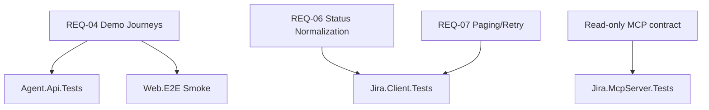
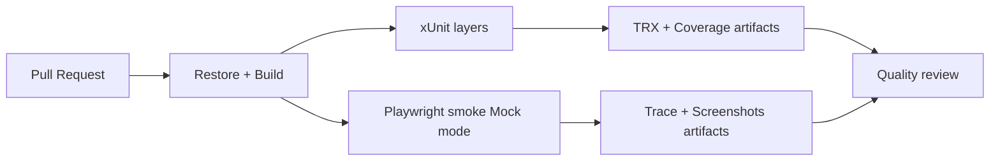

# Phase 4: Test automation and quality visibility - Research

**Researched:** 2026-05-26
**Domain:** .NET 10 test automation (xUnit + Playwright) and CI quality visibility
**Confidence:** MEDIUM

<user_constraints>
## User Constraints (from CONTEXT.md)

### Locked Decisions
- **D-01:** Playwright smoke coverage must include 3 critical journeys: blocked issues, sprint summary, and executive report flow.
- **D-02:** Phase 4 E2E scope is happy-path focused; negative-path scenarios are deferred.
- **D-03:** E2E data must use deterministic Mock fixtures for stable PR validation.
- **D-04:** E2E gate for merge requires 100% passing smoke tests (no quarantine baseline in this phase).
- **D-05:** Playwright runs in PR CI against Mock mode only.
- **D-06:** No nightly Jira Cloud E2E run in this phase.
- **D-07:** Baseline anti-flaky strategy is moderate timeouts plus 1 retry.
- **D-08:** xUnit priority is Jira.Client and DemoAgentService coverage first.
- **D-09:** Agent.Api and Jira.McpServer should include in-memory integration tests for wiring and endpoint behavior.
- **D-10:** Jira.Client resilience behavior (retry, paging, mapping) should be tested deterministically using fake HttpMessageHandler rather than live network.
- **D-11:** No fixed line-percentage target for this phase; coverage is measured by critical-path confidence.
- **D-12:** Mermaid artifacts live under `docs/testing/`.
- **D-13:** Required Mermaid outputs in this phase: (1) coverage-by-layer diagram and (2) CI execution flow diagram.
- **D-14:** Mermaid updates are enforced by PR checklist and reviewer checks, not auto-generation.
- **D-15:** Missing Mermaid updates produce a warning signal, not a hard merge block, in this phase.
- **D-16:** Preserve read-only behavior in MCP and API surfaces while adding tests.
- **D-17:** Preserve deterministic and explainable behavior for core demo prompts.

### the agent's Discretion
- Test project folder naming and exact test file granularity.
- Fixture composition details as long as deterministic behavior is preserved.
- Assertion style and helper abstraction choices for readability and maintainability.

### Deferred Ideas (OUT OF SCOPE)
- Add E2E negative-path suites for API error and timeout behavior.
- Add nightly Cloud-sandbox E2E validation.
- Promote Mermaid freshness checks from warning to blocking gate once test process stabilizes.
</user_constraints>

<phase_requirements>
## Phase Requirements

| ID | Description | Research Support |
|----|-------------|------------------|
| REQ-04 | Return answers for core demo flows (blocked issues, sprint summary, assignee workload, executive summaries). [CITED: .planning/REQUIREMENTS.md] | Smoke E2E happy paths + DemoAgentService/API contract tests ensure these flows stay stable in Mock mode. [ASSUMED] |
| REQ-06 | Normalize Jira status into consistent internal reporting states. [CITED: .planning/REQUIREMENTS.md] | Jira.Client unit tests target `NormalizeStatus`, blocked detection, and summary counters from mixed statuses. [VERIFIED: codebase grep] |
| REQ-07 | Handle pagination and rate-limit conditions without breaking demo flow. [CITED: .planning/REQUIREMENTS.md] | Fake `HttpMessageHandler` tests for paging loops, `Retry-After`, retry count exhaustion, and truncation logging. [VERIFIED: codebase grep] |
</phase_requirements>

## Project Constraints (from copilot-instructions.md)

- Treat `gsd-*` commands as GSD workflow invocations and use matching skills/agents. [CITED: .github/copilot-instructions.md]
- Do not apply GSD workflows unless explicitly requested by user. [CITED: .github/copilot-instructions.md]
- After completing a `gsd-*` deliverable, offer the user the next step via ask loop. [CITED: .github/copilot-instructions.md]

## Summary

Phase 4 should introduce a layered quality gate where fast deterministic xUnit tests protect domain and API seams, and a small Playwright smoke suite protects end-user behavior for the three locked journeys in Mock mode. This aligns with the current architecture where `DemoAgentService` routes prompts to `IJiraReader`, `JiraCloudReader` contains resilience logic, and minimal API/MCP surfaces are thin wiring layers. [VERIFIED: codebase grep]

The most practical structure is four test projects: `tests/Jira.Client.Tests`, `tests/Agent.Api.Tests`, `tests/Jira.McpServer.Tests`, and `tests/Web.E2E`. Keep E2E scope to locked happy paths and enforce merge gates through deterministic PR jobs. Publish TRX, coverage XML, Playwright traces/screenshots to artifacts for diagnosis and quality visibility. [CITED: https://learn.microsoft.com/en-us/dotnet/core/tools/dotnet-test-vstest] [CITED: https://docs.github.com/en/actions/tutorials/store-and-share-data] [CITED: https://playwright.dev/dotnet/docs/ci-intro]

**Primary recommendation:** Use a two-tier CI gate: Tier 1 (`dotnet test` xUnit) as required fast gate, Tier 2 (Playwright smoke in Mock mode with one retry) as required behavior gate, both publishing deterministic artifacts and Mermaid-backed quality docs. [ASSUMED]

## Architectural Responsibility Map

| Capability | Primary Tier | Secondary Tier | Rationale |
|------------|-------------|----------------|-----------|
| Prompt classification and response composition | API / Backend | Jira.Client | `DemoAgentService` contains deterministic branching and response shaping. [VERIFIED: codebase grep] |
| Jira query transport, retry, paging, mapping | API / Backend | Database / Storage (external Jira API as data source) | `JiraCloudReader` owns HTTP, retry strategy, paging loops, and mapping. [VERIFIED: codebase grep] |
| MCP tool exposure (read-only) | API / Backend | Jira.Client | `JiraTools` delegates directly to `IJiraReader`; tests verify read-only behavior by surface contract. [VERIFIED: codebase grep] |
| User journey validation | Browser / Client | API / Backend | Playwright validates web prompt flow and response rendering across web -> API path. [CITED: https://playwright.dev/dotnet/docs/intro] |
| CI test orchestration and evidence publication | Frontend Server (CI orchestration tier) | CDN / Static (artifact storage) | GitHub Actions drives stages and artifact retention/visibility. [CITED: https://docs.github.com/en/actions/tutorials/store-and-share-data] |

## Standard Stack

### Core
| Library | Version | Purpose | Why Standard |
|---------|---------|---------|--------------|
| `xunit` [ASSUMED] | 2.9.3 [VERIFIED: nuget.org] | Unit/integration test framework for .NET projects | Official Microsoft .NET testing tutorial uses xUnit with `dotnet test`. [CITED: https://learn.microsoft.com/en-us/dotnet/core/testing/unit-testing-csharp-with-xunit] |
| `Microsoft.NET.Test.Sdk` [ASSUMED] | 18.5.1 [VERIFIED: nuget.org] | Test host adapter for `dotnet test` | Required test host package for xUnit/VSTest execution. [CITED: https://learn.microsoft.com/en-us/dotnet/core/tools/dotnet-test-vstest] |
| `Microsoft.Playwright.Xunit` [ASSUMED] | 1.60.0 [VERIFIED: nuget.org] | Browser E2E with xUnit base classes | Playwright .NET documents xUnit test-runner support and CI usage. [CITED: https://playwright.dev/dotnet/docs/intro] |

### Supporting
| Library | Version | Purpose | When to Use |
|---------|---------|---------|-------------|
| `xunit.runner.visualstudio` [ASSUMED] | 3.1.5 [VERIFIED: nuget.org] | Discovery + IDE/VSTest integration | Keep in test csproj for tooling compatibility. [CITED: https://learn.microsoft.com/en-us/dotnet/core/testing/unit-testing-csharp-with-xunit] |
| `coverlet.collector` [ASSUMED] | 10.0.1 [VERIFIED: nuget.org] | Cross-platform coverage collection via `dotnet test --collect` | Use in CI artifact publication and regression trend visibility. [CITED: https://learn.microsoft.com/en-us/dotnet/core/tools/dotnet-test-vstest] |
| `Microsoft.AspNetCore.Mvc.Testing` [ASSUMED] | 10.0.8 [VERIFIED: nuget.org] | In-memory host for API integration tests | Recommended for ASP.NET integration tests with `WebApplicationFactory`. [CITED: https://learn.microsoft.com/en-us/aspnet/core/test/integration-tests] |

### Alternatives Considered
| Instead of | Could Use | Tradeoff |
|------------|-----------|----------|
| Playwright .NET xUnit | Playwright .NET NUnit | NUnit is valid but introduces mixed test frameworks in one solution without clear gain for this phase. [CITED: https://playwright.dev/dotnet/docs/intro] |
| `WebApplicationFactory` integration tests | Pure unit tests only | Faster but misses endpoint wiring and serialization regressions in minimal APIs. [CITED: https://learn.microsoft.com/en-us/aspnet/core/test/integration-tests] |

**Installation:**
```bash
dotnet new xunit -n Jira.Client.Tests -o tests/Jira.Client.Tests
dotnet new xunit -n Agent.Api.Tests -o tests/Agent.Api.Tests
dotnet new xunit -n Jira.McpServer.Tests -o tests/Jira.McpServer.Tests
dotnet new xunit -n Web.E2E -o tests/Web.E2E
dotnet add tests/Agent.Api.Tests/Agent.Api.Tests.csproj package Microsoft.AspNetCore.Mvc.Testing
dotnet add tests/Web.E2E/Web.E2E.csproj package Microsoft.Playwright.Xunit
```

## Package Legitimacy Audit

> slopcheck unavailable on this machine (`python`/`pip` missing), therefore all proposed packages are tagged `[ASSUMED]` and must be human-verified before install. [VERIFIED: local environment]

| Package | Registry | Age | Downloads | Source Repo | slopcheck | Disposition |
|---------|----------|-----|-----------|-------------|-----------|-------------|
| `xunit` [ASSUMED] | NuGet [VERIFIED: nuget.org] | Unknown in-session [ASSUMED] | 916,580,627 total [VERIFIED: nuget.org] | xunit/xunit [ASSUMED] | unavailable | Approved with human verification |
| `Microsoft.NET.Test.Sdk` [ASSUMED] | NuGet [VERIFIED: nuget.org] | Unknown in-session [ASSUMED] | 1,627,317,842 total [VERIFIED: nuget.org] | microsoft/vstest [ASSUMED] | unavailable | Approved with human verification |
| `Microsoft.Playwright.Xunit` [ASSUMED] | NuGet [VERIFIED: nuget.org] | Unknown in-session [ASSUMED] | 846,923 total [VERIFIED: nuget.org] | microsoft/playwright-dotnet [CITED: https://playwright.dev/dotnet/docs/intro] | unavailable | Approved with human verification |
| `Microsoft.AspNetCore.Mvc.Testing` [ASSUMED] | NuGet [VERIFIED: nuget.org] | Unknown in-session [ASSUMED] | 320,662,802 total [VERIFIED: nuget.org] | dotnet/aspnetcore [ASSUMED] | unavailable | Approved with human verification |
| `coverlet.collector` [ASSUMED] | NuGet [VERIFIED: nuget.org] | Unknown in-session [ASSUMED] | 896,571,909 total [VERIFIED: nuget.org] | coverlet-coverage/coverlet [ASSUMED] | unavailable | Approved with human verification |

**Packages removed due to slopcheck [SLOP] verdict:** none (tool unavailable)
**Packages flagged as suspicious [SUS]:** none (tool unavailable)

## Architecture Patterns

### System Architecture Diagram

```mermaid
flowchart LR
    U[User in Web UI] --> W[Web (Blazor)]
    W --> A[Agent.Api /api/agent/ask]
    A --> D[DemoAgentService routing]
    D --> I[IJiraReader abstraction]
    I --> M[MockJiraReader in CI Mock mode]
    I --> C[JiraCloudReader in Cloud mode]
    C --> J[Jira REST API]
    A --> MT[Jira.McpServer tools]
    MT --> I

    subgraph CI[GitHub Actions PR Gate]
      B1[xUnit layers]
      B2[Playwright smoke]
      B3[TRX + Coverage + Trace artifacts]
      B1 --> B3
      B2 --> B3
    end
```

### Recommended Project Structure
```text
tests/
├── Jira.Client.Tests/          # unit tests for mapping/retry/paging logic
├── Agent.Api.Tests/            # integration tests for /api/agent/ask + health
├── Jira.McpServer.Tests/       # integration tests for demo endpoints and tool parity
└── Web.E2E/                    # Playwright smoke journeys in Mock mode

docs/testing/
├── coverage-by-layer.mmd       # Mermaid: quality scope by layer
└── ci-execution-flow.mmd       # Mermaid: CI test flow and artifacts
```

### Pattern 1: Deterministic Fixture Boundary via `IJiraReader`
**What:** Use in-memory deterministic fixtures at the seam (`IJiraReader`) to avoid network non-determinism in API/MCP and E2E tests. [VERIFIED: codebase grep]
**When to use:** All PR CI runs (locked decision D-03, D-05). [CITED: .planning/phases/04-test-automation-and-quality-visibility/04-CONTEXT.md]
**Example:**
```csharp
// Source: https://learn.microsoft.com/en-us/aspnet/core/test/integration-tests
public sealed class FakeJiraReader : IJiraReader
{
    public Task<IReadOnlyList<JiraIssue>> GetBlockedIssuesAsync(string projectKey, CancellationToken cancellationToken = default)
        => Task.FromResult<IReadOnlyList<JiraIssue>>(new[]
        {
            new JiraIssue("KM-101", projectKey, "Build blocked", "Blocked", "High", "David", "", "", "Sprint 12", true, 2, DateTimeOffset.UtcNow, new[] { "blocked" })
        });

    // Implement other members with stable fixture data.
}
```

### Pattern 2: HTTP Resilience Tests with Fake `HttpMessageHandler`
**What:** Unit test `JiraCloudReader` retries, `Retry-After`, and pagination by injecting deterministic handler responses. [VERIFIED: codebase grep]
**When to use:** REQ-07 coverage (retry/paging/rate-limit behavior). [CITED: .planning/REQUIREMENTS.md]
**Example:**
```csharp
// Source: codebase pattern in JiraCloudReader + official xUnit guidance
[Fact]
public async Task SearchAsync_Retries429ThenSucceeds()
{
    var handler = new QueueMessageHandler(
        TooManyRequests(withRetryAfterSeconds: 1),
        Ok(SearchResponseJson(total: 1, issues: new[] { Issue("KM-1") })));

    var client = new HttpClient(handler) { BaseAddress = new Uri("https://example.atlassian.net/") };
    var reader = CreateReader(client, retryCount: 1);

    var issues = await reader.GetProjectIssuesAsync("KM");

    Assert.Single(issues);
    Assert.Equal(2, handler.Calls);
}
```

### Anti-Patterns to Avoid
- **Live Jira Cloud in PR smoke:** introduces network/auth flakiness and conflicts with D-05. [CITED: .planning/phases/04-test-automation-and-quality-visibility/04-CONTEXT.md]
- **Large E2E matrix in Phase 4:** exceeds locked happy-path scope and slows gate feedback loop. [CITED: .planning/phases/04-test-automation-and-quality-visibility/04-CONTEXT.md]
- **Shared mutable fixture state:** causes order-dependent failures; prefer immutable fixture snapshots per test. [ASSUMED]

## Don't Hand-Roll

| Problem | Don't Build | Use Instead | Why |
|---------|-------------|-------------|-----|
| ASP.NET in-memory host bootstrap | Custom ad-hoc host harness | `WebApplicationFactory` (`Microsoft.AspNetCore.Mvc.Testing`) | Handles content root, TestServer lifecycle, and DI override seams correctly. [CITED: https://learn.microsoft.com/en-us/aspnet/core/test/integration-tests] |
| Browser automation lifecycle | Custom Selenium wrapper | Playwright .NET test runner classes | Native trace/video support and modern locator/assertion model. [CITED: https://playwright.dev/dotnet/docs/intro] |
| Test result artifact packaging | Custom shell zip scripts | `actions/upload-artifact@v4` | Standardized upload, retention controls, and digest validation warnings. [CITED: https://docs.github.com/en/actions/tutorials/store-and-share-data] |

**Key insight:** Quality visibility is stronger when tool-native diagnostics (TRX, coverage XML, Playwright trace) are preserved as first-class CI artifacts instead of custom logs. [ASSUMED]

## Common Pitfalls

### Pitfall 1: Fixture Drift Between xUnit and E2E
**What goes wrong:** API tests pass but E2E fails because expected mock data diverges across fixture sources. [ASSUMED]
**Why it happens:** Multiple independent fixture definitions evolve separately. [ASSUMED]
**How to avoid:** Centralize deterministic fixture JSON under `tests/Fixtures/mock-jira.json` and consume from both test layers. [ASSUMED]
**Warning signs:** Frequent string-based assertion updates in only one layer. [ASSUMED]

### Pitfall 2: Flaky Playwright Assertions on Dynamic Text
**What goes wrong:** Assertions fail intermittently due to timing/render sequence. [ASSUMED]
**Why it happens:** Immediate text assertion before response is rendered. [ASSUMED]
**How to avoid:** Use locator-based web-first assertions and bounded waits; keep one retry (D-07) only for transient renderer timing. [CITED: https://playwright.dev/dotnet/docs/intro]
**Warning signs:** Pass-on-retry trend increasing over time. [ASSUMED]

### Pitfall 3: Incomplete Resilience Coverage in Jira.Client
**What goes wrong:** Paging/retry regressions escape because only happy-path parsing is tested. [ASSUMED]
**Why it happens:** Tests skip 429/5xx and `Retry-After` branches. [VERIFIED: codebase grep]
**How to avoid:** Add explicit scenario matrix for 200->next page, 429->retry, 500->retry, max retries exhausted. [ASSUMED]
**Warning signs:** Errors only discovered in cloud demos, not CI. [ASSUMED]

## Code Examples

### Minimal High-Value Tests by Layer
```csharp
// Jira.Client.Tests (REQ-06, REQ-07)
[Fact] public async Task GetSprintSummary_Normalizes_Statuses_And_Risks();
[Fact] public async Task GetProjectIssues_Paginates_Until_Total_Or_MaxPages();
[Fact] public async Task Search_Retries_On_429_And_Respects_RetryAfter();

// Agent.Api.Tests (REQ-04)
[Theory]
[InlineData("Que issues estan bloqueadas en KM?", "get_blocked_issues")]
[InlineData("Resume el sprint actual", "get_sprint_summary")]
[InlineData("Dame un informe ejecutivo", "get_sprint_summary")]
public async Task AskEndpoint_Returns_Expected_ToolHint(string question, string expectedTool);

// Jira.McpServer.Tests (read-only contract)
[Fact] public async Task DemoBlockedEndpoint_Returns_Deterministic_Mock_Data();
[Fact] public async Task DemoSprintSummaryEndpoint_Returns_Stable_Fields();

// Web.E2E (D-01 smoke)
[Fact] public async Task Smoke_BlockedIssues_Journey();
[Fact] public async Task Smoke_SprintSummary_Journey();
[Fact] public async Task Smoke_ExecutiveReport_Journey();
```

## State of the Art

| Old Approach | Current Approach | When Changed | Impact |
|--------------|------------------|--------------|--------|
| Manual demo verification only | Automated smoke + integration gates in PR | Current phase target [CITED: .planning/ROADMAP.md] | Prevents regressions in core journeys before merge. [ASSUMED] |
| Build-only CI | Build + `dotnet test` + Playwright smoke + artifacts | Current phase target [CITED: .planning/ROADMAP.md] | Adds objective quality evidence per PR. [ASSUMED] |

**Deprecated/outdated:**
- Relying on cloud/manual validation as the only confidence source for core demo flows. [ASSUMED]

## Assumptions Log

| # | Claim | Section | Risk if Wrong |
|---|-------|---------|---------------|
| A1 | Shared fixture file strategy can be adopted without friction in this repo. | Common Pitfalls | Medium - may need per-project fixtures initially. |
| A2 | Two-tier CI gate runtime will remain acceptable for PR cadence. | Summary / Validation Architecture | Medium - may require selective test filtering. |
| A3 | `Microsoft.Playwright.Xunit` is preferred over NUnit in this team context. | Standard Stack | Low - NUnit remains fallback. |
| A4 | Mermaid freshness can be checked with lightweight warning job without extra tooling burden. | Mermaid documentation strategy | Low - may require script hardening later. |

## Resolution Notes

1. Playwright scope is finalized as Web UI smoke journeys only in PR Mock mode, per locked decisions. API contract verification remains in xUnit integration tests to preserve deterministic, low-flake browser coverage. [CITED: .planning/phases/04-test-automation-and-quality-visibility/04-CONTEXT.md]

2. Coverage policy for this phase is finalized as artifact publication plus warning-level visibility only, with no enforced percentage threshold. Threshold enforcement is intentionally deferred to a later hardening phase per D-11. [CITED: .planning/phases/04-test-automation-and-quality-visibility/04-CONTEXT.md]

## Environment Availability

| Dependency | Required By | Available | Version | Fallback |
|------------|------------|-----------|---------|----------|
| .NET SDK | xUnit/Playwright test projects and CI | ✓ | 10.0.300 [VERIFIED: local environment] | — |
| Node.js | Playwright browser install scripts | ✓ | v24.15.0 [VERIFIED: local environment] | Install browsers via Playwright script only |
| npm | JS tooling bootstrap when needed by Playwright runtime assets | ✓ | 11.12.1 [VERIFIED: local environment] | — |
| PowerShell (`pwsh`) | Playwright browser install command | ✓ | 7.6.1 [VERIFIED: local environment] | — |
| Python/pip | slopcheck protocol tool | ✗ | — [VERIFIED: local environment] | Mark all packages `[ASSUMED]` and gate installs with human verification |
| ctx7 CLI fallback | Context7 docs fallback | ✗ | — [VERIFIED: local environment] | Use official docs/web fetch citations |

**Missing dependencies with no fallback:** none

**Missing dependencies with fallback:**
- `python`/`pip` for slopcheck (fallback applied: `[ASSUMED]` package classification).
- `ctx7` CLI (fallback applied: official docs fetch).

## Validation Architecture

### Test Framework
| Property | Value |
|----------|-------|
| Framework | xUnit + `dotnet test` (VSTest default runner on .NET 10 unless overridden) [CITED: https://learn.microsoft.com/en-us/dotnet/core/tools/dotnet-test] |
| Config file | none yet - add `Directory.Build.props` test settings and optional `.runsettings` in Wave 0 [ASSUMED] |
| Quick run command | `dotnet test --configuration Release --no-build --logger "trx;LogFilePrefix=tests" --collect:"XPlat Code Coverage"` [CITED: https://learn.microsoft.com/en-us/dotnet/core/tools/dotnet-test-vstest] |
| Full suite command | `dotnet test AgentJiraMCPAccelerator.slnx --configuration Release --logger "trx;LogFilePrefix=full" --collect:"XPlat Code Coverage"` [CITED: https://learn.microsoft.com/en-us/dotnet/core/tools/dotnet-test-vstest] |

### Phase Requirements -> Test Map
| Req ID | Behavior | Test Type | Automated Command | File Exists? |
|--------|----------|-----------|-------------------|-------------|
| REQ-04 | Core demo answers remain stable (blocked/sprint/executive) | integration + e2e smoke | `dotnet test tests/Agent.Api.Tests/Agent.Api.Tests.csproj -c Release` and `dotnet test tests/Web.E2E/Web.E2E.csproj -c Release` | ❌ Wave 0 |
| REQ-06 | Status normalization remains deterministic | unit | `dotnet test tests/Jira.Client.Tests/Jira.Client.Tests.csproj -c Release --filter "FullyQualifiedName~NormalizeStatus"` | ❌ Wave 0 |
| REQ-07 | Paging/rate-limit resilience remains deterministic | unit | `dotnet test tests/Jira.Client.Tests/Jira.Client.Tests.csproj -c Release --filter "FullyQualifiedName~Retry|FullyQualifiedName~Paging"` | ❌ Wave 0 |

### Sampling Rate
- **Per task commit:** `dotnet test tests/Jira.Client.Tests/Jira.Client.Tests.csproj -c Release`
- **Per wave merge:** `dotnet test AgentJiraMCPAccelerator.slnx -c Release --logger "trx;LogFilePrefix=wave"`
- **Phase gate:** Full xUnit + Playwright smoke green before `/gsd-verify-work`

### Wave 0 Gaps
- [ ] `tests/Jira.Client.Tests/JiraCloudReaderTests.cs` - REQ-06/REQ-07 scenario matrix
- [ ] `tests/Agent.Api.Tests/AgentAskEndpointTests.cs` - REQ-04 API route verification
- [ ] `tests/Jira.McpServer.Tests/DemoEndpointsTests.cs` - read-only surface verification
- [ ] `tests/Web.E2E/SmokeJourneysTests.cs` - D-01 journeys
- [ ] Playwright browser install step in CI: `pwsh ./tests/Web.E2E/bin/Release/net10.0/playwright.ps1 install --with-deps` (Linux runner path may vary by build output) [CITED: https://playwright.dev/dotnet/docs/ci-intro]

## CI Stages and Commands

1. **Build stage (existing + tighten flags)**
   - `dotnet restore`
   - `dotnet build --configuration Release --no-restore`
2. **xUnit stage (required gate)**
   - `dotnet test AgentJiraMCPAccelerator.slnx --configuration Release --no-build --logger "trx;LogFilePrefix=unit" --collect:"XPlat Code Coverage" --results-directory ./artifacts/test-results`
3. **Playwright smoke stage (required gate, Mock mode only)**
   - `dotnet test tests/Web.E2E/Web.E2E.csproj --configuration Release --no-build`
   - Configure one retry in Playwright xUnit base setup (D-07), bounded timeouts.
4. **Artifact publication stage (always run on failure/success)**
   - Upload `./artifacts/test-results/**/*.trx`
   - Upload `./artifacts/test-results/**/coverage.cobertura.xml`
   - Upload Playwright trace/screenshots/logs
   - Use `actions/upload-artifact@v4` with `retention-days` set (example 7). [CITED: https://docs.github.com/en/actions/tutorials/store-and-share-data]

## Deterministic Fixture Strategy for Mock Mode CI

1. Define one canonical fixture corpus (`tests/Fixtures/jira-mock-stable.json`) with stable IDs, statuses, priorities, assignees, and sprint names. [ASSUMED]
2. Load this corpus in a shared test helper package (or linked source file) consumed by `Jira.Client.Tests`, API integration tests, MCP integration tests, and Playwright setup. [ASSUMED]
3. Freeze time-sensitive values using explicit fixed timestamps in fixtures to avoid age/day drift assertions. [ASSUMED]
4. For `JiraCloudReader` unit tests, avoid real clock/network: fake handler responses + deterministic `Retry-After` headers + fixed created/updated values. [VERIFIED: codebase grep]
5. Keep fixture updates via explicit PRs and mention in Mermaid coverage diagram update checklist (D-14/D-15 warning policy). [CITED: .planning/phases/04-test-automation-and-quality-visibility/04-CONTEXT.md]

## Mermaid Documentation Strategy

- Create `docs/testing/coverage-by-layer.mmd` showing layer-to-test-type mapping and requirement traceability (REQ-04/06/07). [CITED: .planning/phases/04-test-automation-and-quality-visibility/04-CONTEXT.md]
- Create `docs/testing/ci-execution-flow.mmd` showing CI stages, dependencies, and artifact outputs. [CITED: .planning/phases/04-test-automation-and-quality-visibility/04-CONTEXT.md]
- Enforce updates via PR template checklist item: "If tests changed, update Mermaid docs/testing diagrams" (warning-only policy in this phase). [CITED: .planning/phases/04-test-automation-and-quality-visibility/04-CONTEXT.md]
- Suggested diagrams:





## Security Domain

### Applicable ASVS Categories

| ASVS Category | Applies | Standard Control |
|---------------|---------|-----------------|
| V2 Authentication | yes | Ensure tests never require real Jira Cloud secrets in PR; use Mock fixtures and CI secrets hygiene. [CITED: https://playwright.dev/dotnet/docs/ci-intro] |
| V3 Session Management | no | Not a primary concern for this phase scope (no auth/session feature changes). [ASSUMED] |
| V4 Access Control | yes | Preserve read-only endpoint/tool behavior in API/MCP tests (D-16). [CITED: .planning/phases/04-test-automation-and-quality-visibility/04-CONTEXT.md] |
| V5 Input Validation | yes | Add contract tests for ask payload shape and null/empty handling in API route boundaries. [ASSUMED] |
| V6 Cryptography | no | No new cryptographic implementation introduced in this phase. [ASSUMED] |

### Known Threat Patterns for this stack

| Pattern | STRIDE | Standard Mitigation |
|---------|--------|---------------------|
| Secret leakage in CI artifacts (trace/log) | Information Disclosure | Redact tokens, avoid real credentials in Mock mode, restrict artifact retention. [CITED: https://playwright.dev/dotnet/docs/ci-intro] |
| Flaky tests bypassed manually | Repudiation/Tampering | Required gate + deterministic fixtures + one-retry cap with failure artifacts. [ASSUMED] |
| Endpoint behavior drift without visibility | Tampering | Layered tests + Mermaid coverage map + PR checklist warning. [ASSUMED] |

## Sources

### Primary (HIGH confidence)
- https://learn.microsoft.com/en-us/dotnet/core/testing/unit-testing-csharp-with-xunit - xUnit setup, package baseline, `dotnet test` workflow.
- https://learn.microsoft.com/en-us/aspnet/core/test/integration-tests - `WebApplicationFactory`, integration test organization, service overrides.
- https://learn.microsoft.com/en-us/dotnet/core/tools/dotnet-test-vstest - TRX logger, results directory, coverage collector commands.
- https://playwright.dev/dotnet/docs/intro - Playwright .NET runner options including xUnit.
- https://playwright.dev/dotnet/docs/ci-intro - CI setup and trace artifact practices.
- https://docs.github.com/en/actions/tutorials/store-and-share-data - artifact upload/retention and workflow data sharing.
- Local repo code and planning docs (`04-CONTEXT.md`, `README.md`, `.github/workflows/ci.yml`, source files listed in task). [VERIFIED: codebase grep]

### Secondary (MEDIUM confidence)
- NuGet package search (`dotnet package search ...`) for package existence/version/download signals.

### Tertiary (LOW confidence)
- None.

## Metadata

**Confidence breakdown:**
- Standard stack: MEDIUM - official docs + local NuGet verification, but slopcheck unavailable so package legitimacy remains `[ASSUMED]`.
- Architecture: HIGH - based on direct code inspection of service seams and current CI workflow.
- Pitfalls: MEDIUM - partially inferred from common patterns, not all observed in this repo yet.

**Research date:** 2026-05-26
**Valid until:** 2026-06-25