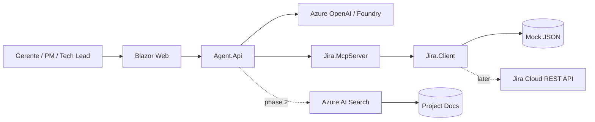

# Enterprise Agent Accelerator: Jira MCP + Azure + .NET

A GitHub-ready accelerator to demonstrate how a governed enterprise agent can use Jira as an operational system through a .NET MCP Server, then evolve toward Azure AI Foundry, Azure AI Search, Entra ID, and production-grade governance.

> Demo positioning: **Jira already has the data. This accelerator turns Jira into an enterprise agent tool for executive summaries, delivery insights, risk detection, reporting automation, and cross-system reasoning.**

## Why this exists

This repository is designed for a Microsoft Expert Center / presales environment:

- Show a live demo in 10–15 minutes.
- Explain MCP using a concrete Jira use case.
- Start with mock data, then switch to Jira Cloud REST API.
- Keep a clean roadmap for initial and future capabilities.
- Use a lightweight GSD-style workflow: questions → requirements → roadmap → phase plan → execution → verification → ship.

## Initial demo capabilities

| Capability | Status | Description |
|---|---:|---|
| Mock Jira dataset | Ready | Local JSON issues for demos without Jira access. |
| Jira client abstraction | Ready | Interface-based client with mock and Jira Cloud implementations. |
| MCP Server | Ready scaffold | Exposes Jira tools over HTTP using the C# MCP SDK pattern. |
| Agent API | Ready scaffold | REST endpoint that simulates tool selection and prepares migration to Azure OpenAI / Foundry. |
| Blazor Web UI | Ready scaffold | Simple chat-style demo UI. |
| Aspire orchestration | Ready scaffold | Local developer composition for API, MCP, and Web. |
| Azure infra | Ready scaffold | Bicep template for Container Apps, ACR, Key Vault, App Insights, Storage, AI Search placeholders. |
| GSD planning system | Ready | Product brief, phases, backlog, verification checklist and prompts. |

## Architecture



## Quick start

### Prerequisites

- .NET 10 SDK recommended, .NET 9/8 can be used by changing `TargetFramework` in `Directory.Build.props`.
- Optional: Azure Developer CLI (`azd`) and Azure CLI.
- Optional: Jira Cloud sandbox and API token.
- Optional: Azure OpenAI / Microsoft Foundry access.

### Run locally

```bash
# clone your GitHub repo after uploading this accelerator
cd enterprise-agent-accelerator

# restore and run API against mock Jira data
dotnet restore

dotnet run --project src/Jira.McpServer/Jira.McpServer.csproj
# new terminal
dotnet run --project src/Agent.Api/Agent.Api.csproj
# new terminal
dotnet run --project src/Web/Web.csproj
```

Open:

- Web UI: `https://localhost:7040`
- Agent API: `https://localhost:7041/swagger`
- MCP Server: `https://localhost:7042/mcp`

> Ports can be changed in `launchSettings.json`.

## Demo prompts

Use these prompts from the UI or API:

```text
¿Qué issues están bloqueadas en el proyecto KM?
Resume el estado del sprint actual para comité de dirección.
¿Qué épicas tienen más riesgo y por qué?
Dame un informe ejecutivo del proyecto KM con riesgos, bloqueos y próximos pasos.
¿Qué tareas tiene asignadas David?
```

## Configuration

Local mock mode is enabled by default:

```json
{
  "Jira": {
    "Mode": "Mock",
    "MockDataPath": "../../samples/jira-mock-data.json"
  }
}
```

To use Jira Cloud:

```bash
dotnet user-secrets set "Jira:Mode" "Cloud" --project src/Jira.McpServer
dotnet user-secrets set "Jira:BaseUrl" "https://your-domain.atlassian.net" --project src/Jira.McpServer
dotnet user-secrets set "Jira:Email" "name@company.com" --project src/Jira.McpServer
dotnet user-secrets set "Jira:ApiToken" "<token>" --project src/Jira.McpServer
```

## Repository structure

```text
src/
  Agent.Api/           REST agent facade for demo and future LLM orchestration
  Jira.Client/         Jira domain model + mock/cloud client implementations
  Jira.McpServer/      MCP server exposing Jira tools
  Shared/              Shared contracts and DTOs
  Web/                 Blazor demo UI
  AppHost/             Aspire composition scaffold
infra/
  bicep/               Azure deployment scaffold
docs/
  architecture.md      Reference architecture
  demo-script.md       10-minute demo script
  gsd/                 GSD-inspired planning system
samples/
  jira-mock-data.json  Demo dataset
.github/
  workflows/           CI build workflow
```

## GSD-inspired workflow

This repo intentionally keeps a `.gsd/` and `docs/gsd/` planning layer so the accelerator evolves without context rot:

1. `docs/gsd/01-product-brief.md`
2. `docs/gsd/02-requirements.md`
3. `docs/gsd/03-roadmap.md`
4. `docs/gsd/04-phase-1-plan.md`
5. `docs/gsd/05-verification-checklist.md`
6. `.gsd/prompts/` for AI coding agents such as Copilot, Codex, Cursor, Claude Code, etc.

The original `gsd-build/get-shit-done` repository now indicates it moved to `open-gsd/get-shit-done-redux`. This accelerator does **not** vendor GSD code; it uses the same working philosophy: explicit requirements, small phases, verification before shipping, and continuity files.

## Roadmap

### Phase 1 — MVP local demo

- Mock Jira data.
- Jira MCP tools.
- Agent API.
- Web demo.
- Demo script.

### Phase 2 — Real Jira integration

- Jira Cloud REST API.
- API token for demo; OAuth 2.0 for enterprise.
- JQL support.
- Write actions behind approval gates.

### Phase 3 — Azure enterprise demo

- Azure Container Apps.
- Azure Key Vault.
- Application Insights.
- Azure AI Search.
- Azure OpenAI / Microsoft Foundry.

### Phase 4 — Enterprise governance

- Entra ID.
- RBAC by project.
- Audit log.
- Tool-call approval.
- Private networking.
- Multi-system MCP extensions: Azure DevOps, GitHub, ServiceNow, Confluence, SharePoint.

## License

MIT. Replace with your company standard if required.
