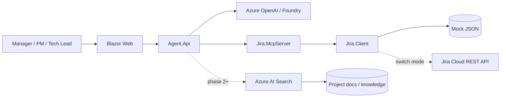

# Agent Jira MCP Accelerator: Jira MCP + Azure + .NET

[](LICENSE)
[](https://dotnet.microsoft.com/)
[](https://modelcontextprotocol.io/)
[](docs/architecture.md)
[](https://github.com/davidop/agent-jira-mcp-accelerator/actions/workflows/deploy.yml)

Acelerador orientado a produccion para convertir Jira en una herramienta de agentes enterprise con MCP, con un camino claro desde demo local con mock data hasta Jira Cloud y gobierno en Azure.

> Mensaje clave: Jira ya tiene los datos de delivery. Este proyecto convierte esos datos en insights accionables para agentes: resumen ejecutivo, deteccion de riesgos, reporting y seguimiento operativo.

## Tabla de contenidos

- [Para quien es](#para-quien-es)
- [Presales playbook (comercial)](#presales-playbook-comercial)
- [Que incluye](#que-incluye)
- [Como funciona](#como-funciona)
- [Arquitectura](#arquitectura)
- [Quick start (10 minutos)](#quick-start-10-minutos)
- [Checklist de sandbox Jira](#checklist-de-sandbox-jira)
- [Configuracion](#configuracion)
- [Prompts de demo](#prompts-de-demo)
- [Estructura del repositorio](#estructura-del-repositorio)
- [Roadmap](#roadmap)
- [Contribuciones](#contribuciones)
- [FAQ](#faq)
- [Troubleshooting](#troubleshooting)
- [Seguridad y gobierno](#seguridad-y-gobierno)
- [Licencia](#licencia)

## Para quien es

- Equipos de presales y Expert Center que necesitan una demo convincente.
- Equipos de plataforma y arquitectura que evaluan MCP en contexto enterprise.
- Stakeholders de Jira y delivery governance que quieren reporting asistido por IA sin reemplazar Jira.
- Developers que buscan una referencia practica en .NET para MCP + Jira.

## Presales playbook (comercial)

Usa esta seccion como talk track en reuniones con cliente, account planning y demos ejecutivas.

### Posicionamiento comercial

- No es "otro chatbot": es un operational copilot sobre datos de delivery ya confiables para negocio.
- Time-to-value inmediato: empieza con mock data, conecta sandbox Jira y escala a controles enterprise.
- Low disruption: sin reemplazo de Jira, sin reset de procesos y sin migraciones obligatorias para capturar valor.

### Pain points que resuelve

- Direccion dedica demasiado tiempo a pedir estado y poco a actuar sobre riesgos.
- La informacion de delivery esta fragmentada entre boards, proyectos y equipos.
- La calidad del reporting depende de trabajo manual e interpretacion inconsistente.
- Muchas iniciativas de IA no consiguen conectarse de forma segura a sistemas operativos reales.

### Hipotesis de valor por stakeholder

- CIO / CTO: camino gobernado de piloto a despliegue enterprise.
- PMO / delivery leads: reporting ejecutivo mas rapido y estandarizado.
- Engineering managers: visibilidad temprana de bloqueos y riesgo de entrega.
- Security / platform: acceso controlado a herramientas, trazabilidad y hardening progresivo.

### Storyline recomendado de demo (10-15 min)

1. Arranca con una pregunta ejecutiva en lenguaje natural.
2. Muestra una respuesta aterrizada en issues y contexto de sprint.
3. Lanza un follow-up de riesgo para aflorar bloqueos y dependencias.
4. Cierra con el camino enterprise: identidad, RBAC, auditoria, aprobaciones y Azure landing zone.

### Por que gana en presales

- Concreto y creible: anclado en Jira, no en ejemplos sinteticos.
- Rapido de ejecutar: funciona el dia uno en modo mock.
- Narrativa enterprise-ready: el gobierno esta en el diseno, no como parche posterior.
- Expandible: mismo patron para Azure DevOps, GitHub, ServiceNow, Confluence y SharePoint.

### Objection handling rapido

- "Ya tenemos dashboards": dashboards muestran datos; agentes explican implicaciones y proximas acciones.
- "La IA es arriesgada": esta arquitectura empieza read-only, least-privilege y approval-gated para escritura.
- "Integrar lleva meses": esta POC esta pensada para first demo en dias, no trimestres.

## Que incluye

| Capacidad | Estado | Valor |
|---|---:|---|
| Mock Jira dataset | Ready | Demo en cualquier entorno, incluso sin acceso Jira. |
| Abstraccion de cliente Jira | Ready | Cambio limpio entre mock y Jira Cloud. |
| MCP Server en C# | Ready scaffold | Expone herramientas Jira para runtimes de agentes. |
| Agent API facade | Ready scaffold | Capa REST para orquestacion y evolucion a LLMs. |
| Blazor Web demo | Ready scaffold | Interaccion en lenguaje natural en minutos. |
| Aspire AppHost | Ready scaffold | Orquestacion local de servicios. |
| Infra Azure | Ready scaffold | Baseline Bicep para despliegue enterprise. |
| Artefactos GSD | Ready | Requisitos, roadmap y verificacion trazables. |

## Como funciona

1. Un usuario lanza una pregunta desde Web UI o API.
2. Agent.Api decide que herramienta MCP invocar.
3. Jira.McpServer ejecuta la operacion usando Jira.Client.
4. Jira.Client lee de JSON mock o de Jira Cloud REST API.
5. El agente devuelve respuesta concisa y accionable para decision.

## Arquitectura



## Quick start (10 minutos)

### Prerrequisitos

- .NET SDK 10 recomendado.
- Opcional: Azure CLI y Azure Developer CLI (`azd`).
- Opcional: sandbox Jira Cloud y API token.

### Run local (manual)

```bash
dotnet restore

dotnet run --project src/Jira.McpServer/Jira.McpServer.csproj
# new terminal
dotnet run --project src/Agent.Api/Agent.Api.csproj
# new terminal
dotnet run --project src/Web/Web.csproj
```

### Run local (Aspire AppHost)

```bash
dotnet run --project src/AppHost/AppHost.csproj
```

### Endpoints

- Web UI: `https://localhost:7040`
- Agent API (Swagger): `https://localhost:7041/swagger`
- MCP endpoint: `https://localhost:7042/mcp`

Puedes cambiar puertos en launch settings de cada proyecto.

## Checklist de sandbox Jira

Usa este checklist al pedir entorno al equipo administrador de Jira.

- Instancia Jira Cloud sandbox (no-produccion).
- Un proyecto software (ejemplo: `KM`) con backlog y sprint activo.
- Issues representativos:
  - Epic, Story, Task, Bug.
  - Estados mixtos: To Do, In Progress, Blocked, Done.
  - Multiples assignees.
  - Prioridades y due dates variadas.
  - Algunos bloqueos y dependencias.
- Cuenta tecnica con permisos API de lectura sobre el proyecto.
- Si se habilita escritura mas adelante, aislarla en proyecto de pruebas con control de aprobacion.

### Datos minimos de conexion

- `BaseUrl`: `https://<tenant>.atlassian.net`
- `Email`: email de la cuenta tecnica
- `ApiToken`: Jira Cloud API token

Con estos valores pasas de modo `Mock` a `Cloud`.

## Configuracion

### Modo por defecto (mock)

```json
{
  "Jira": {
    "Mode": "Mock",
    "MockDataPath": "../../samples/jira-mock-data.json"
  }
}
```

### Modo Jira Cloud (user secrets)

```bash
dotnet user-secrets set "Jira:Mode" "Cloud" --project src/Jira.McpServer
dotnet user-secrets set "Jira:BaseUrl" "https://your-domain.atlassian.net" --project src/Jira.McpServer
dotnet user-secrets set "Jira:Email" "name@company.com" --project src/Jira.McpServer
dotnet user-secrets set "Jira:ApiToken" "<token>" --project src/Jira.McpServer
```

## Prompts de demo

Usa estos prompts en Web UI o API para mostrar valor de negocio rapido.

```text
Que issues estan bloqueadas en el proyecto KM?
Resume el estado del sprint actual para comite de direccion.
Que epicas tienen mas riesgo y por que?
Dame un informe ejecutivo del proyecto KM con riesgos, bloqueos y proximos pasos.
Que tareas tiene asignadas David?
```

## Estructura del repositorio

```text
src/
  Agent.Api/           Agent REST facade y punto de entrada de orquestacion
  Jira.Client/         Modelos de dominio Jira + lectores mock/cloud
  Jira.McpServer/      MCP server que expone herramientas Jira
  Shared/              Contratos compartidos y DTOs
  Web/                 UI demo en Blazor
  AppHost/             Composicion local con Aspire
infra/
  bicep/               Baseline de despliegue en Azure
docs/
  architecture.md      Arquitectura de referencia
  demo-script.md       Guion de demo en 10 minutos
  gsd/                 Product brief, requirements, roadmap, plan, verification
samples/
  jira-mock-data.json  Dataset de demo
```

## Roadmap

### Fase 1: MVP local demo

- Mock Jira data.
- Jira MCP tools.
- Agent API.
- Web demo.

### Fase 2: Integracion Jira real

- Jira Cloud REST API.
- Soporte JQL con plantillas deterministas.
- Paginacion, reintentos y manejo de rate limits.
- Modo read-only para demo enterprise segura.

### Fase 3: Demo enterprise en Azure

- Azure Container Apps.
- Key Vault.
- Application Insights.
- Azure AI Search.
- Azure OpenAI / Foundry.

Estado actual:
- Provision + publish a ACR implementado en CI/CD.
- Runtime en Azure Container Apps implementado y validado por URL.
- Integraciones AI avanzadas se mantienen como siguiente etapa.

### Fase 4: Gobierno enterprise

- Integracion Entra ID.
- RBAC por proyecto.
- Audit trail.
- Aprobacion de tool-calls.
- Networking privado.
- Expansion multi-sistema MCP (Azure DevOps, GitHub, ServiceNow, Confluence, SharePoint).

## Estado de release v1.0

- Jira Cloud en modo read-only completado.
- Test automation (xUnit + Playwright smoke) integrado en CI.
- Diagramas Mermaid de cobertura y flujo CI disponibles en `docs/testing`.
- Despliegue Azure con publicacion de imagenes y runtime de Container Apps disponible via workflow.
- Hardening de gobierno enterprise (Entra, RBAC fino, aprobaciones de escritura) permanece como fase posterior.

## Contribuciones

Contribuciones bienvenidas. Para PRs de alto valor:

1. Abre una issue explicando caso de uso y comportamiento esperado.
2. Mantiene cambios acotados e incluye tests cuando aplique.
3. Actualiza docs si cambia el comportamiento.
4. Usa commits claros e incluye impacto before/after en la descripcion del PR.

## FAQ

### Esta listo para produccion?

Es un acelerador production-minded, no un producto cerrado. Esta pensado para demostrar patrones de arquitectura y servir como base solida.

### Necesito acceso Jira para ejecutarlo?

No. El modo mock viene activo por defecto con dataset local.

### Soporta operaciones de escritura en Jira?

Si, en fases posteriores y bajo controles explicitos de aprobacion y gobierno.

### Por que MCP en lugar de llamadas directas desde la UI?

MCP desacopla herramientas de interfaces, permite integraciones mas seguras y reutilizables entre clientes y runtimes.

## Troubleshooting

- Si Web UI no carga datos, verifica que Jira.McpServer y Agent.Api estan activos.
- Si falla Jira Cloud mode, revisa Jira:BaseUrl, Jira:Email y Jira:ApiToken en user secrets.
- Si los puertos HTTPS cambian en tu maquina, revisa launch settings y actualiza URLs.

## Seguridad y gobierno

- Prioriza sandbox data para demos.
- Evita exponer informacion sensible de produccion.
- Usa cuentas tecnicas con privilegio minimo.
- Activa auditoria, RBAC y aprobaciones antes de habilitar escritura.

## Documentacion relacionada

- [Arquitectura de referencia](docs/architecture.md)
- [Demo script](docs/demo-script.md)
- [Documentacion GSD](docs/gsd/)

## Licencia

MIT.
