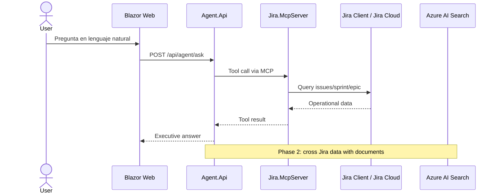

# Architecture

## Runtime view

## Services

- `Jira.Client`: domain model and data access abstraction.
- `Jira.McpServer`: exposes Jira tools to MCP-compatible clients.
- `Agent.Api`: demo orchestration facade; future Azure OpenAI / Foundry integration point.
- `Web`: Blazor UI for executive live demos.
- `AppHost`: Aspire composition scaffold.

## Security design

MVP:

- Mock data by default.
- Jira token only via user-secrets or Key Vault.
- Read-only operations first.

Enterprise:

- OAuth 2.0 for Atlassian.
- Entra ID authentication on the Web/API.
- RBAC by Jira project.
- Tool approval gates for write operations.
- Audit log for every tool call.
- Managed identity and Key Vault.
